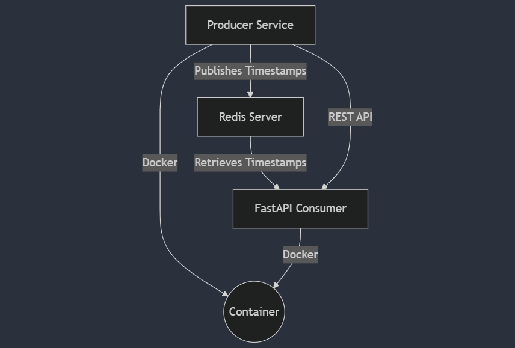
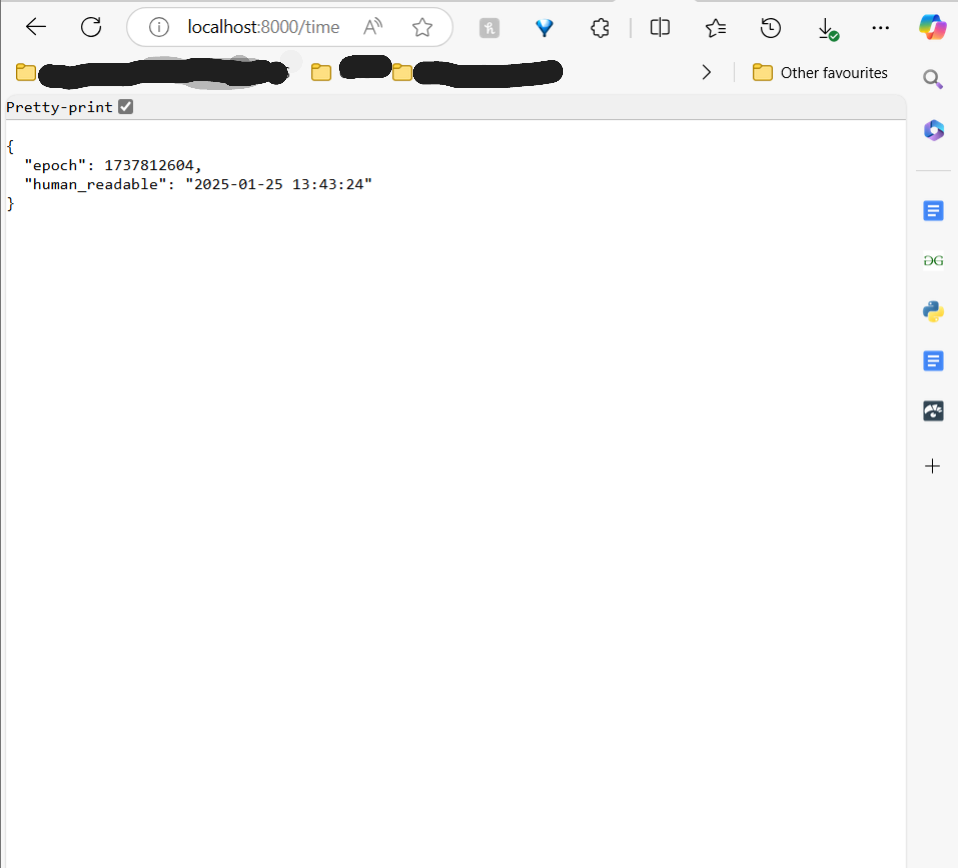

# DieDev-Microservice
# Project Name: Timestamp Producer
# Creator: Greenfield O. St Jean

## Project Overview
The Timestamp Producer is a microservice that periodically publishes the current timestamp to a Redis server using Python's scheduling capabilities to ensure timestamps are published at regular intervals. 
The FastAPI Consumer service retrieves and displays the current timestamp from Redis via an API endpoint.

## Key Technologies Used
- **Python** - Usage Rationale: Chosen for its simplicity and powerful features for scripting and automation, making it ideal for writing the producer and consumer services.
- **Redis** - Usage Rationale: Familiarity with the technology and its simplicity in usage, providing quick in-memory data storage. 
Alternatives could have included a database or hidden text file.
- **FastAPI** - Usage Rationale: Used to experiment with quick API setup while considering other frameworks like Django, Flask, and a vanilla JSON response to understand the best fit for the microservice.
- **Docker** - Usage Rationale: Necessary for containerizing the microservice, ensuring consistent environment across different stages of development, testing, and production.
- **Schedule** - Usage Rationale: Easy-to-use library for scheduling tasks in Python, perfectly fitting the need to periodically publish timestamps.
- **.env** - Usage Rationale: Helps in managing environment variables and maintaining configurations outside the codebase for better security and flexibility.

## Architecture Explanation


The architecture consists of:
1. **Redis**: An in-memory data store running in a Docker container that stores the published timestamps.
2. **Producer**: A Python script running in a Docker container that generates and publishes timestamps to Redis at regular intervals
3. **FastAPI Consumer**: A service that retrieves and displays the current timestamp from Redis via an API endpoint.

## Setup/Build Instructions [Windows 11]
1. **Clone the repository**:
    ```bash
    git clone https://github.com/gstjean-cmu-F24/DieDev-Microservice.git
    cd DieDev-Microservice
    ```

2. **Create and activate a virtual environment**:
    ```bash
    py -3.10 -m venv venv ### make sure to use python 3.10 to avoid conflicts with flask api and pydantic
    python -m venv venv
    `venv\Scripts\activate`
    ```

3. **Install the dependencies**:
    ```bash
    pip install -r requirements.txt
    ```

4. **Set up environment variables**:
    Create a `.env` file in the root directory and add the following:
    ```env
    REDIS_HOST=your_redis_host [should be an integer say 5789]
    REDIS_PORT=add_your_port [should be an integer say 8080]
    SCHEDULE_INTERVAL=add_your_schedule [should be an integer say 5]
    ```

## Docker Deployment Steps
1. **Build the Docker images**:
    ```bash
    docker-compose build
    ```

2. **Run the Docker containers**:
    ```bash
    docker-compose up
    ```

3. **Check the logs to verify deployment**:
    ```bash
    docker-compose logs
    ```
## Tests
   **Run the tests with **:
    ```python
    pytest tests
    ```


## Future Improvements
- Profiling, as the scope increases to identify bottlenecks
- Better Frontend design to display API
- Orchestration with Kubernetes
- Graphana/Prometheus to monitor logs
- Bug tracking W/ Sentry
- & Much More

## Final Output

